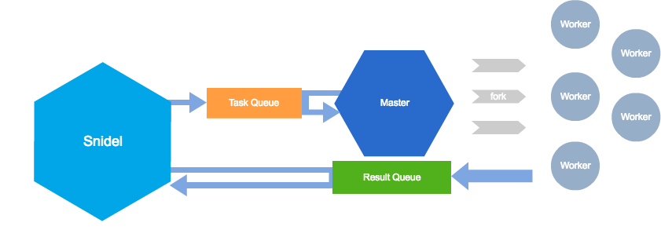

# Snidel

A multi-process container. It looks like multi-thread-ish.

[](https://packagist.org/packages/ackintosh/snidel) [](https://packagist.org/packages/ackintosh/snidel) [](https://travis-ci.org/ackintosh/snidel) [](https://scrutinizer-ci.com/g/ackintosh/snidel/?branch=master) [](https://coveralls.io/github/ackintosh/snidel?branch=master)

## Installing Snidel via Composer

```
$ composer require ackintosh/snidel
```

## Architecture



This image was made with <a href="https://cacoo.com/" target="_blank">cacoo</a>.

## Usage

### Basic

```php
<?php
use Ackintosh\Snidel;

$func = function ($str) {
    sleep(3);
    return $str;
};

$s = time();
$snidel = new Snidel();
$snidel->fork($func, 'foo');
$snidel->fork($func, 'bar');
$snidel->fork($func, 'baz');

$snidel->wait();// optional

// Snidel::get() returns instance of Snidel\Result\Collection
$collection = $snidel->get();

// Snidel\Result\Collection implements \Iterator
foreach ($collection as $result) {
    echo $result->getFork()->getPid();
    echo $result->getOutput();
    echo $result->getReturn();
}

var_dump($collection->toArray());
// * the order of results is not guaranteed. *
// array(3) {
//   [0]=>
//   string(3) "bar"
//   [1]=>
//   string(3) "foo"
//   [2]=>
//   string(3) "baz"
// }

echo (time() - $s) . 'sec elapsed' . PHP_EOL;
// 3sec elapsed.
```

### Same argument as `call_user_func_array`

```php
// multiple arguments
$snidel->fork($func, ['foo', 'bar']);

// global function
$snidel->fork('myfunction');

// instance method
$snidel->fork([$instance, 'method']);

```

### Get results with tags

```php
$snidel->fork($func, 'foo', 'tag1');
$snidel->fork($func, 'bar', 'tag1');
$snidel->fork($func, 'baz', 'tag2');

var_dump($snidel->get('tag1')->toArray());
// array(2) {
//   [0]=>
//   string(3) "foo"
//   [1]=>
//   string(3) "bar"
// }

// throws InvalidArgumentException when passed unknown tags.
$snidel->get('unknown_tags');
// InvalidArgumentException: There is no tags: unknown_tags
```

### Concurrency

```php
$snidel = new Snidel($concurrency = 3);

```

### Output log

```php
$fp = fopen('php://stdout', 'w');
$snidel->setLoggingDestination($fp);

// logs are output to the `php://stdout`
$snidel->fork($func, 'foo');

// [2015-12-01 00:00:00][info][26304(p)] created child process. pid: 26306
// [2015-12-01 00:00:00][info][26306(c)] --> waiting for the token to come around.
// [2015-12-01 00:00:00][info][26306(c)] ----> started the function.
// [2015-12-01 00:00:00][info][26306(c)] <-- return token.
// ...

```

### Connect the functions in parallel

```php
$args = [
    'BRING ME THE HORIZON',
    'ARCH ENEMY',
    'BULLET FOR MY VALENTINE',
    'RACER X',
    'OF MICE AND MEN',
    'AT THE GATES',
];

$snidel = new Snidel($concurrency = 2);

// * Snidel::map() is available as array_map().
//   and use Snidel::then(), you can connect the result.
// * $camelize is instance of Snidel\MapContainer which has the functions you defined.
// * the functions are not yet executed.
$camelize = $snidel->map($args, function (Array $arg) {
    return explode(' ', strtolower($arg));
    // array(4) {
    //   [0] =>
    //   string(5) "bring"
    //   [1] =>
    //   string(2) "me"
    //   [2] =>
    //   string(3) "the"
    //   [3] =>
    //   string(7) "horizon"
    // }
})->then(function (\Ackintosh\Snidel\Result\Result $result) {
    // Snidel\Result\Result::getFork() returns instance of Snidel\Fork .
    // Snidel\Fork has informations about previous process.
    echo $result->getFork()->getPid();

    return array_map('ucfirst', $result->getReturn());
    // array(4) {
    //   [0] =>
    //   string(5) "Bring"
    //   [1] =>
    //   string(2) "Me"
    //   [2] =>
    //   string(3) "The"
    //   [3] =>
    //   string(7) "Horizon"
    // }
})->then(function (\Ackintosh\Snidel\Result\Result $result) {
    return implode('', $result->getReturn());
    // string(17) "BringMeTheHorizon"
});

// * each of the functions are performed in parallel.
var_dump($snidel->run($camelize));
// array(6) {
//   [0] =>
//   string(6) "RacerX"
//   [1] =>
//   string(20) "BulletForMyValentine"
//   [2] =>
//   string(9) "ArchEnemy"
//   [3] =>
//   string(17) "BringMeTheHorizon"
//   [4] =>
//   string(10) "AtTheGates"
//   [5] =>
//   string(12) "OfMiceAndMen"
// }
```

### Error informations of children

```php
$snidel->fork(function ($arg1, $arg2) {
    exit(1);
}, ['foo', 'bar']);
$snidel->wait();

var_dump($snidel->getError());
// class Ackintosh\Snidel\Error#4244 (1) {
// ...
// }

foreach ($snidel->getError() as $pid => $e) {
    var_dump($pid, $e);
}
// int(51813)
// array(5) {
//   'status' =>  int(256)
//   'message' => string(50) "an error has occurred in child process.
//   'callable' => string(9) "*Closure*"
//   'args' =>
//     array(2) {
//       [0] => string(3) "foo"
//       [1] => string(3) "bar"
//     }
//   'return' => NULL
//   }
// }
```

## Requirements

Snidel works with PHP 5.3 or higher.

- [PCNTL functions](http://php.net/manual/en/ref.pcntl.php)
- [Semaphore functions](http://php.net/manual/en/ref.sem.php)

## Author

Akihito Nakano

blog entries by author about snidel. (japanese)

- http://ackintosh.github.io/blog/2015/09/29/snidel/
- http://ackintosh.github.io/blog/2015/11/08/snidel_0_2_0/

## License

[The MIT License](http://opensource.org/licenses/MIT)
